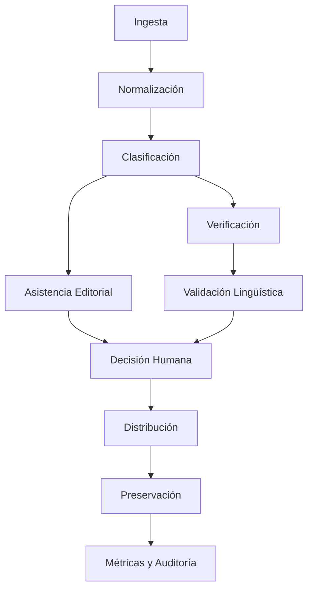

Arquitectura · MONITOR CIID

Modelo de innovación tecnológica para la información.

Principio rector

La tecnología asiste. El periodista decide.

Pipeline CIID



Multi-tenancy

```
Monitor Noticias → tenant: monitor-noticias
Municipio A     → tenant: municipio-a
Municipio B     → tenant: municipio-b
Institución C   → tenant: institucion-c
```

Jerarquía territorial

```
Estado → Región → Distrito → Municipio → Localidad → Comunidad
```

Campos culturales

· culturalZone
· originLanguage
· languageVariant
· validatedBy
· consent

Lenguas previstas: Zapoteco, Mixteco, Mazateco.

Módulos

Módulo Responsabilidad
auth Autenticación y roles
tenants Multi-tenancy
ingest Recepción
normalization Limpieza
classification Etiquetado
editorial Asistencia editorial
verification Contraste con fuentes
linguistic Validación lingüística
decision Decisión humana
distribution Publicación
preservation Archivo patrimonial
metrics Analítica
citizen Participación ciudadana
audit Trazabilidad

---

<p align="center">
  <em>Innovar para informar. Digitalizar para preservar.</em>
</p>
